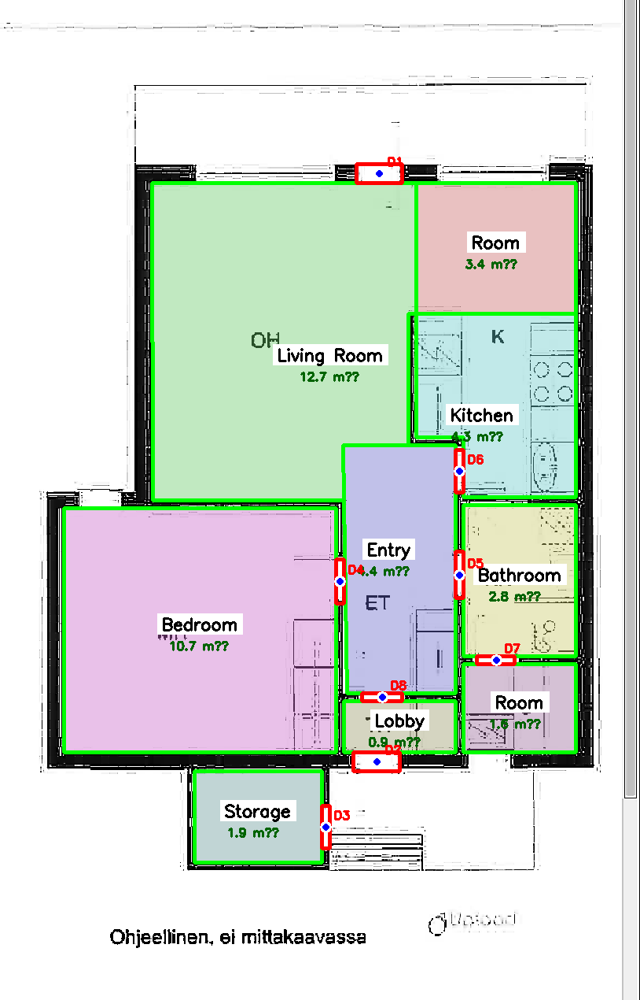
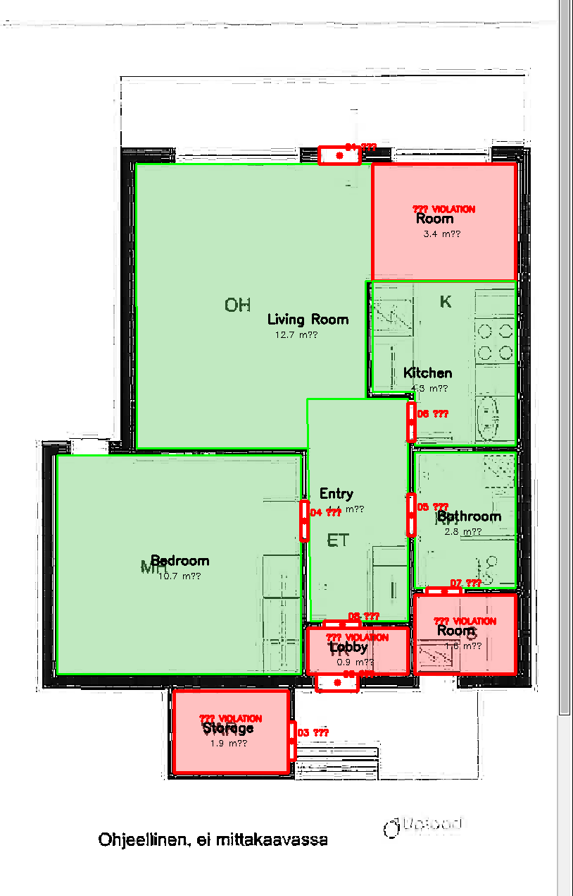
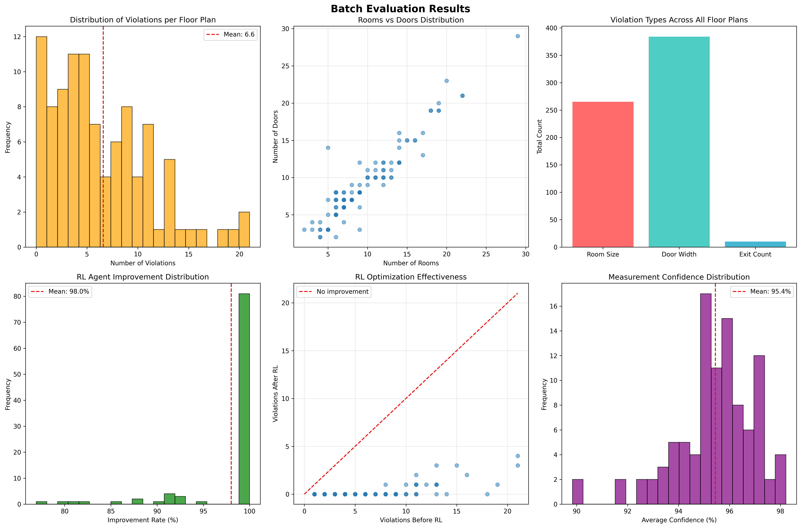

<div align="center">

# 🏗️ AI-Driven Building Code Compliance Checker

**Automated detection and resolution of building code violations in floor plans using computer vision, probabilistic reasoning, and reinforcement learning.**

[](https://python.org)
[](https://opencv.org)
[](https://numpy.org)
[](https://scipy.org)

*CS 686 Final Project — University of Waterloo, November 2025*

---

</div>

## 📋 Table of Contents

- [Overview](#overview)
- [Key Results](#-key-results)
- [Architecture](#-architecture)
- [Pipeline Phases](#-pipeline-phases)
  - [Phase 1 — Floor Plan Parsing](#phase-1--floor-plan-parsing--visualization)
  - [Phase 2 — Constraint Checking](#phase-2--building-code-constraint-checking)
  - [Phase 3 — Uncertainty Modeling](#phase-3--probabilistic-uncertainty-modeling)
  - [Phase 4 — RL Optimization](#phase-4--reinforcement-learning-optimization)
  - [Batch Evaluation](#batch-evaluation)
- [Tech Stack](#-tech-stack)
- [Getting Started](#-getting-started)
- [Usage](#-usage)
- [Project Structure](#-project-structure)
- [Building Codes Reference](#-building-codes-reference)

---

## Overview

This project implements a **vision-based parsing and optimization engine** that automates the detection of building code violations in SVG floor plans. Rather than relying on rigid deterministic rules, the system combines:

- **Computer vision** to parse architectural floor plans from the CubiCasa5k dataset
- **Constraint satisfaction** to check compliance against international building codes
- **Gaussian probabilistic reasoning** to handle measurement uncertainty
- **Q-Learning (Reinforcement Learning)** to autonomously resolve violations

The result is a four-phase pipeline that can parse a floor plan, identify code violations, quantify confidence under uncertainty, and suggest optimized layouts — all in under 0.2 seconds per plan.

---

## 🏆 Key Results

| Metric | Value |
|--------|-------|
| Violation reduction (RL agent) | **97.5%** |
| Auto-resolution rate (CSP solver) | **82.5%** |
| Batch throughput | **1,000+ plans** |
| Per-plan latency | **~0.2 seconds** |

---

## 🔬 Architecture

The system is organized as a **four-phase sequential pipeline**, where each phase imports and builds on the previous one:

```
┌──────────────────────────────────────────────────────────────────────┐
│                        INPUT: CubiCasa5k SVG                        │
└──────────────────────────┬───────────────────────────────────────────┘
                           │
                           ▼
┌──────────────────────────────────────────────────────────────────────┐
│  PHASE 1: Floor Plan Parsing                                        │
│  ├─ SVG/XML parsing → room & door extraction                        │
│  ├─ Polygon geometry (area, bounding box, center)                   │
│  └─ Evaluation metrics (F1, IoU via Hungarian matching)             │
└──────────────────────────┬───────────────────────────────────────────┘
                           │  rooms[], doors[]
                           ▼
┌──────────────────────────────────────────────────────────────────────┐
│  PHASE 2: Constraint Checking                                       │
│  ├─ Room size constraints (IBC minimums)                            │
│  ├─ Door width constraints (entrance vs. interior)                  │
│  ├─ Exit count requirements                                         │
│  └─ CSP solver validation (python-constraint)                       │
└──────────────────────────┬───────────────────────────────────────────┘
                           │  violations[]
                           ▼
┌──────────────────────────────────────────────────────────────────────┐
│  PHASE 3: Probabilistic Uncertainty Modeling                        │
│  ├─ Measurement confidence scoring                                  │
│  ├─ Gaussian distributions for area & door width                    │
│  └─ CDF-based compliance probability (P(actual ≥ required))        │
└──────────────────────────┬───────────────────────────────────────────┘
                           │  prob_results[]
                           ▼
┌──────────────────────────────────────────────────────────────────────┐
│  PHASE 4: RL-Based Optimization                                     │
│  ├─ FloorPlanEnvironment (state, actions, rewards)                  │
│  ├─ Q-Learning agent (ε-greedy, Q-table)                            │
│  └─ Best action sequence replay                                     │
└──────────────────────────┬───────────────────────────────────────────┘
                           │
                           ▼
┌──────────────────────────────────────────────────────────────────────┐
│                   OUTPUT: Optimized Floor Plan                       │
│           Compliance report + suggested modifications                │
└──────────────────────────────────────────────────────────────────────┘
```

---

## 🔄 Pipeline Phases

### Phase 1 — Floor Plan Parsing & Visualization

**File:** `phase1_final_floor_parsing.py`

Parses CubiCasa5k SVG annotation files to extract structured room and door data.

**What it does:**
- Parses SVG/XML using `xml.etree.ElementTree`, extracting `Space` (room) and `Door` elements
- Computes polygon geometry: area, bounding box, center point, orientation
- Classifies rooms by type (Living Room, Bedroom, Kitchen, Bathroom, etc.)
- Classifies doors by type and orientation (horizontal/vertical)
- Filters out noise (outdoor spaces, areas < 0.5 m²)

**Evaluation metrics:**
- Uses the **Hungarian algorithm** (`scipy.optimize.linear_sum_assignment`) for optimal matching between predicted and ground-truth detections
- Computes **Precision, Recall, F1 Score**, and **mean IoU**
- Supports both polygon-level IoU (via rasterization with OpenCV) and bounding-box IoU

**Output:** Lists of room and door dictionaries with geometry, type, and metadata.

<p align="center">
  
  <br><em>Phase 1: Room and door detection with labeled floor plan overlay</em>
</p>

---

### Phase 2 — Building Code Constraint Checking

**File:** `phase2_final_constraint_checking.py`

Checks detected rooms and doors against simplified **International Building Code (IBC)** standards.

**Constraints enforced:**

| Check | Rule | Severity |
|-------|------|----------|
| Room size | Each room type must meet a minimum area (e.g., Bedroom ≥ 7.0 m²) | HIGH |
| Door width | Entrance doors ≥ 80 cm, interior doors ≥ 70 cm | MEDIUM–HIGH |
| Exit count | Dwelling must have ≥ 2 exits | CRITICAL |

**Features:**
- Heuristic-based door classification (entrance vs. interior based on perimeter proximity)
- **CSP solver** (`python-constraint`) to validate whether any valid configuration exists
- Violations grouped and reported by severity: `CRITICAL` → `HIGH` → `MEDIUM`

**Output:** List of violation objects with type, severity, deficit, and human-readable messages.

<p align="center">
  
  <br><em>Phase 2: Compliance report with violations highlighted</em>
</p>

---

### Phase 3 — Probabilistic Uncertainty Modeling

**File:** `phase3_final_uncertainty.py`

Adds **probabilistic reasoning** to account for measurement uncertainty in SVG-derived data.

**`MeasurementUncertainty` model accounts for:**
- **Area uncertainty** — 5% base uncertainty, scaled by polygon complexity and shape irregularity
- **Door width uncertainty** — ±2 cm base, scaled by door size and position clarity
- **Confidence penalties** for complex polygons (>6 corners), very small rooms (<2 m²), and irregular shapes (low fill ratio)

**Compliance probability:**
- Models each measurement as a **Gaussian distribution** `N(measured, σ)`
- Computes `P(actual ≥ required)` using the **CDF** of the normal distribution
- Classifies results into four statuses:

| Probability | Status | Severity |
|-------------|--------|----------|
| ≥ 95% | `COMPLIANT` | — |
| ≥ 70% | `LIKELY_COMPLIANT` | LOW |
| ≥ 30% | `UNCERTAIN` | MEDIUM |
| < 30% | `LIKELY_VIOLATION` | HIGH |

**Output:** Per-room and per-door compliance probabilities with confidence scores.

---

### Phase 4 — Reinforcement Learning Optimization

**File:** `phase4_final_rl_agent.py`

Trains a **Q-Learning agent** to autonomously resolve building code violations by modifying room dimensions and door widths.

**Environment (`FloorPlanEnvironment`):**
- **State:** compliance status vector for each room and door
- **Actions:** `expand_room` (5% or 10%) and `widen_door` (5 cm or 10 cm), targeting only violating elements
- **Reward:** positive reward for fixing violations, negative reward for no improvement, bonus for full compliance
- **Termination:** all violations resolved or max steps reached

**Agent (`QLearningAgent`):**
- **Policy:** ε-greedy exploration with exponential decay (ε: 1.0 → 0.01)
- **Learning:** Q-table updated via standard Q-learning rule
- **Hyperparameters:** α = 0.3, γ = 0.9, ε-decay = 0.995
- Tracks and replays the **best action sequence** found during training

**Output:** Optimized floor plan state, action history, and training performance metrics.

---

### Batch Evaluation

**File:** `batch_evaluation_final.py`

Evaluates the full pipeline across large subsets of the CubiCasa5k dataset.

**`BatchEvaluator` class:**
- Scans `high_quality`, `high_quality_architectural`, and `colorful` subsets
- Supports official **train/test/val splits** or random sampling
- Runs all four phases per floor plan (50 RL episodes for speed)
- Saves intermediate results every 10 plans as JSON
- Generates aggregate statistics and 6-panel visualization

**Metrics reported:**
- Rooms/doors per plan (mean, min, max, median)
- Violation distribution by type
- RL improvement rate across all non-compliant plans
- Measurement confidence distribution
- Processing time per plan

<p align="center">
  
  <br><em>Batch evaluation across 1000+ floor plans from CubiCasa5k</em>
</p>

---

## 🛠️ Tech Stack

| Category | Technologies |
|----------|-------------|
| **Core** | Python 3.8+, NumPy, SciPy |
| **Vision** | OpenCV (`cv2`) |
| **Parsing** | `xml.etree.ElementTree` |
| **Optimization** | Q-Learning, `python-constraint` (CSP solver) |
| **Visualization** | Matplotlib |
| **Matching** | Hungarian Algorithm (`scipy.optimize.linear_sum_assignment`) |
| **Data** | [CubiCasa5k](https://github.com/CubiCasa/CubiCasa5k) dataset |

---

## 🚀 Getting Started

### Prerequisites

- Python 3.8+
- [CubiCasa5k dataset](https://github.com/CubiCasa/CubiCasa5k) downloaded and extracted

### Installation

```bash
# Clone the repository
git clone https://github.com/NoahGuthrie/AI-Driven-Building-Code-Compliance-Checker.git
cd AI-Driven-Building-Code-Compliance-Checker

# Install dependencies
pip install numpy scipy opencv-python matplotlib python-constraint
```

### Dataset Setup

Download the [CubiCasa5k dataset](https://github.com/CubiCasa/CubiCasa5k) and update the `BASE_PATH` in `phase1_final_floor_parsing.py` to point to your local copy:

```python
# phase1_final_floor_parsing.py — line 18
BASE_PATH = r"path/to/cubicasa5k/cubicasa5k/high_quality/17"
```

Each floor plan directory should contain:
- `F1_scaled.png` — the rasterized floor plan image
- `model.svg` — the SVG annotation file

---

## 💻 Usage

### Run the Full Pipeline (Phases 1–4)

```bash
python phase4_final_rl_agent.py
```

This runs all four phases sequentially on a single floor plan: parsing → compliance check → probabilistic analysis → RL optimization.

### Run Individual Phases

```bash
# Phase 1 only: parse floor plan and display metrics
python phase1_final_floor_parsing.py

# Phases 1–2: parse + compliance check
python phase2_final_constraint_checking.py

# Phases 1–3: parse + compliance + uncertainty
python phase3_final_uncertainty.py
```

### Run Batch Evaluation

```bash
python batch_evaluation_final.py
```

By default, this evaluates 100 randomly sampled floor plans. Configure the `BatchEvaluator` constructor for different settings:

```python
evaluator = BatchEvaluator(
    dataset_path="path/to/cubicasa5k/cubicasa5k",
    num_samples=1000,          # number of plans to evaluate
    use_split="test",          # use official split: 'train', 'test', 'val', or None
    subset="high_quality"      # 'high_quality', 'high_quality_architectural', 'colorful', or 'all'
)
evaluator.run_evaluation()
```

---

## 📁 Project Structure

```
AI-Driven-Building-Code-Compliance-Checker/
│
├── phase1_final_floor_parsing.py         # SVG parsing, room/door extraction, evaluation metrics
├── phase2_final_constraint_checking.py   # Building code checks, CSP solver
├── phase3_final_uncertainty.py           # Probabilistic uncertainty modeling
├── phase4_final_rl_agent.py              # Q-Learning RL agent for violation resolution
├── batch_evaluation_final.py             # Large-scale dataset evaluation
│
├── phase1_final.png                      # Phase 1 output visualization
├── phase2_output.png                     # Phase 2 output visualization
├── batch_evaluation_results.png          # Batch evaluation results chart
│
└── README.md
```

---

## 📖 Building Codes Reference

The system checks against simplified **International Building Code (IBC)** standards:

### Minimum Room Areas

| Room Type | Minimum Area |
|-----------|-------------|
| Living Room | 12.0 m² |
| Bedroom | 7.0 m² |
| Kitchen | 4.2 m² |
| Bathroom | 2.5 m² |
| Other | 4.0 m² |

### Minimum Door Widths

| Door Type | Minimum Width |
|-----------|--------------|
| Entrance / Exit | 80 cm |
| Interior | 70 cm |

### Exit Requirements

| Requirement | Minimum |
|-------------|---------|
| Exits per dwelling | 2 |

---

## Technical Notes

**Handling noisy SVG data:** A key challenge in this project was the high variance in raw SVG data across the CubiCasa5k dataset. A custom ETL process was engineered to transform raw inference tensors into structured logs, enabling retrospective performance analysis and model iteration. This focus on failure-mode diagnosis ensured the system remained robust against edge cases common in real-world spatial data.

---

<div align="center">

**Author:** Noah Guthrie · University of Waterloo · CS 686 · Fall 2025

</div>
